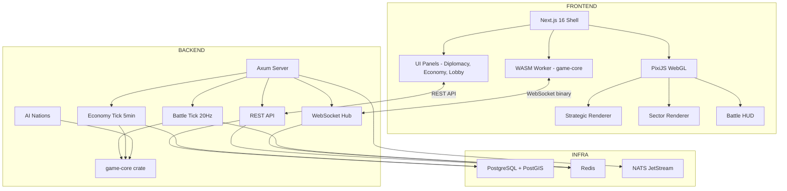
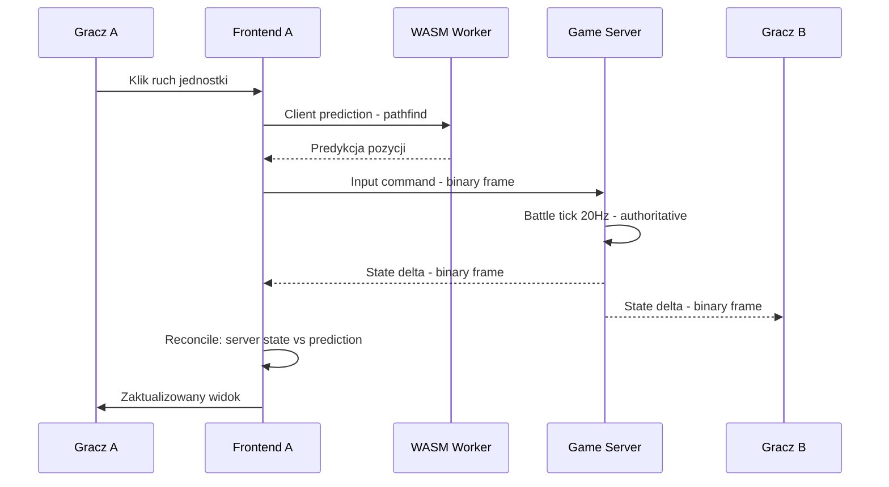
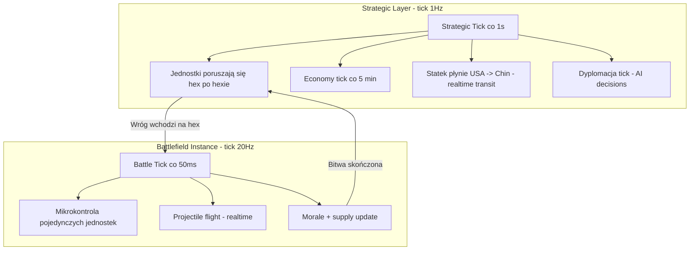
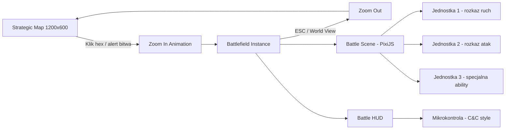
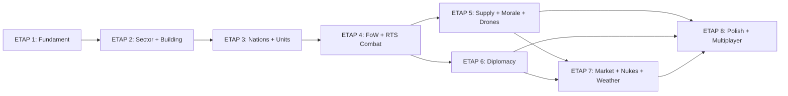
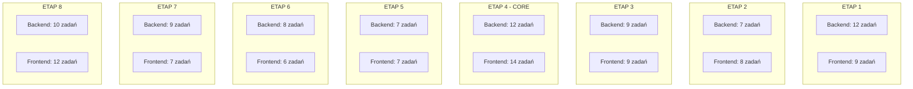

# Grand Strategy RTS — Plan Implementacji z Podziałem Backend/Frontend

## Kluczowe zasady rozgrywki

> **CAŁA GRA JEST REALTIME.** Nie ma systemu turowego. Statek płynie z Ameryki do Chin hex po hexie w czasie rzeczywistym. Ekonomia tickuje. Armie maszerują. Bitwy trwają.
>
> **KAŻDY HEX TO POTENCJALNE POLE BITWY.** Zoom na dowolny hex strategiczny otwiera oddzielną instancję battlefield. Nie trzeba czekać na "sektor" — każdy hex ma pod sobą taktyczną mapę.
>
> **PEŁNA MIKROKONTROLA JEDNOSTEK.** Na polu bitwy gracz wydaje polecenia pojedynczym jednostkom — ruch, atak, strzelanie, specjalne ability. Jak w C&C Generals, nie auto-resolve.

---

## Stan obecny (co już istnieje)

### Backend (Rust)
- [`crates/game-core/`](../crates/game-core/) — hex math ([`hex.rs`](../crates/game-core/src/hex.rs)), terrain ([`terrain.rs`](../crates/game-core/src/terrain.rs)), grid ([`grid.rs`](../crates/game-core/src/grid.rs)) z viewport query i wrap-around
- [`crates/game-core-wasm/`](../crates/game-core-wasm/) — WASM bindings: `init_grid`, `get_viewport_hexes`, `hex_distance`, `hex_neighbors`, `pixel_to_hex_wrapped`, `get_hex_info`, `get_hex_by_coords`
- **Brak**: `game-server` crate, Docker Compose, CI/CD, map pipeline, Postgres schema

### Frontend (Next.js 16 + PixiJS)
- [`apps/web/`](../apps/web/) — Next.js 16 z PixiJS, Tailwind CSS 4
- [`HexMap.tsx`](../apps/web/app/components/HexMap.tsx) — działający renderer strategicznej mapy (664 linii): kamera, zoom, drag, hover, wrap-around, terrain coloring
- [`wasm-loader.ts`](../apps/web/app/lib/wasm-loader.ts) — ładowanie WASM z `public/wasm/`
- **Brak**: sector renderer, UI panele, WebSocket, building system, battle HUD

---

## Architektura — diagram komponentów

## Przepływ danych — bitwa RTS

## Przepływ — realtime świat

## Zoom na hex = otwarcie instancji battlefield

---

## ETAP 1: Fundament — Strategic Map + game-core crate

### 🔧 BACKEND

| # | Zadanie | Szczególy |
|---|---------|-----------|
| 1.1.B | Monorepo setup — Cargo workspace | Rozszerzyć [`Cargo.toml`](../Cargo.toml) o `crates/game-server`, `tools/seed` |
| 1.2.B | Docker Compose | `docker-compose.yml`: Postgres 16 + PostGIS, Redis 7, NATS JetStream, pgAdmin |
| 1.3.B | game-core — hex math rozszerzenie | A* pathfinding wrap-aware, spatial index hex-hash, fixed-point arithmetic |
| 1.4.B | game-core — HPA* hierarchical pathfinding | Dla sektorów 1M hex, kompatybilne z no_std |
| 1.5.B | game-core — unit testy edge cases | Wrap boundary, polar clamp, LOS through mountains, pathfinding correctness |
| 1.6.B | game-core-wasm — nowe bindings | `pathfind`, `spatial_query`, `los_check` |
| 1.7.B | Map Data Pipeline | Python + GDAL: NASA SRTM → 1200x600, Natural Earth coastlines, terrain classification, chokepoints |
| 1.8.B | Seed tool | Rust binary: czyta pipeline output → insert do Postgres |
| 1.9.B | game-server crate — scaffold | Axum + Tokio, composition root, health check endpoint |
| 1.10.B | Map Service — API routes | `GET /api/map/tiles/:lod/:x/:y`, `GET /api/map/hex/:q/:r`, `GET /api/map/region/:q/:r/:radius` |
| 1.11.B | DB schema — Etap 1 | `hex_map`, `nations`, `territories`; PostGIS spatial index |
| 1.12.B | CI/CD — GitHub Actions | cargo check/test/clippy/fmt, cargo-chef caching, wasm-pack build |

### 🎨 FRONTEND

| # | Zadanie | Szczególy |
|---|---------|-----------|
| 1.1.F | pnpm workspace | `pnpm-workspace.yaml` z `packages/shared-types` |
| 1.2.F | Tile loading system | Slippy-map pattern, async fetch + cache, LOD level selection |
| 1.3.F | 5-level LOD renderer | Planet → continent → region → hex grid → detail; shader-based coloring |
| 1.4.F | Camera controls — rozszerzenie | WASD/edge scroll, kinetic inertia, smooth zoom |
| 1.5.F | Instanced WebGL hex mesh | Jeden draw call, shader koloruje per-terrain; zastąpić obecny Graphics approach |
| 1.6.F | Nation borders rendering | Wektorowe, shader-based, z DB data |
| 1.7.F | Minimap widget | Cały world overview, click-to-center |
| 1.8.F | WASM w Web Worker | Off-main-thread pathfinding, Comlink/worker communication |
| 1.9.F | WebLLM PoC — `/lab/llm` | Benchmark 3 modeli, polskie prompty, toggle on/off/auto |

### ✅ Deliverable
Przeglądarka wyświetla mapę świata 1200x600 z heksami, kolorami terenu, granicami państw. Płynny zoom. Seamless wrap E-W. WASM działa. Strona `/lab/llm` z benchmarkiem.

---

## ETAP 2: Battlefield Instance + Zoom Transition + Base Building

> **Każdy hex strategiczny = potencjalne pole bitwy.** Zoom na hex otwiera oddzielną instancję battlefield z własnym terenem, budynkami i jednostkami. Instancja jest lazy-generowana przy pierwszym wejściu i persystuje.

### 🔧 BACKEND

| # | Zadanie | Szczególy |
|---|---------|-----------|
| 2.1.B | Battlefield instance — DB schema | `battlefield_instances` — id, strategic_q, strategic_r, size, seed, terrain_blob, status CALM/ACTIVE; variable sizes 512/1024 |
| 2.2.B | Battlefield API routes | `GET /api/battlefield/:q/:r` — get or lazy-create, `POST /api/battlefield/:q/:r/build`, `GET /api/battlefield/:q/:r/buildings` |
| 2.3.B | Lazy battlefield generation | Deterministic procedural terrain z seed w Rust — fbm noise + biome z macro hex; generuj dopiero gdy ktoś zoomuje po raz pierwszy |
| 2.4.B | Building system — domain | `game-core/src/building/`: types, construction queue, HP, levels, power grid |
| 2.5.B | Fortification system — domain | Trench, Bunker, Minefield, AA Battery, Anti-Tank; defense bonuses |
| 2.6.B | Resource extraction — domain | Deposits, Mine/Well/Farm buildings, production → nation stockpile |
| 2.7.B | Battlefield instance manager | Serwer traci aktywne instancje w pamięci; CALM tick 1Hz, ACTIVE tick 20Hz; instancja usypiana gdy nikt nie ogląda |
| 2.8.B | game-core-wasm — battlefield bindings | `init_battlefield`, `get_battlefield_viewport`, `place_building`, `get_building_info` |

### 🎨 FRONTEND

| # | Zadanie | Szczególy |
|---|---------|-----------|
| 2.1.F | Battlefield scene — PixiJS Container | Osobny Container, swap on transition, terrain rendering; każdy hex na strategic = wejście do battlefield |
| 2.2.F | Zoom transition animation | Strategic → Battlefield: Pixi zoom + fade ~400ms, loading state; smooth zoom-in na kliknięty hex |
| 2.3.F | URL routing — battlefield | `/game/[sessionId]/hex/[q]/[r]` — Next.js 16 typed route; każdy hex ma swój URL |
| 2.4.F | Breadcrumb navigation | World → Europe → Poland → Hex 456,123; ESC / World view button → zoom-out |
| 2.5.F | Building construction UI | Klik hex → radial menu → build; construction queue visualization |
| 2.6.F | Building sprites | Placeholder: colored squares + label per type; power grid lines |
| 2.7.F | Fortification placement | Drag-to-place dla trench lines; defense overlay |
| 2.8.F | Resource deposit overlay | Ikony deposits na battlefield hex, extraction building indicators |
| 2.9.F | Hex click indicator na strategic | Klikalny hex → podświetlenie → tooltip z info → zoom-in button |

### ✅ Deliverable
Gracz klika hex na strategic → zoomuje do battlefield instancji → widzi teren, stawia budynki/fortyfikacje. Każdy hex = osobny battlefield. Buildings persystują. Economy tick widzi production z battlefieldów.

---

## ETAP 3: Nations, Units, Realtime Movement

> **Cała gra jest realtime.** Statek płynie z Ameryki do Chin hex po hexie — gracz widzi ruch na żywo na strategic map. Armie maszerują, konwoje płyną, wszystko w czasie rzeczywistym. Nie ma tur.

### 🔧 BACKEND

| # | Zadanie | Szczególy |
|---|---------|-----------|
| 3.1.B | Nation system — DB schema | `nations`, `nation_state` — budget, policies, government |
| 3.2.B | Nation config — JSON | `packages/game-config/nations/` — 40+ nation configs, tier 1-4, start state |
| 3.3.B | Resource system — domain | `game-core/src/economy/`: FUEL, METALS, TECH, FOOD; ledger, recipes, tick |
| 3.4.B | Economy tick — Tokio scheduled | Tick co 5 min, batch SQL, production/consumption calc |
| 3.5.B | Unit system — domain | `game-core/src/military/`: 6 basic types, stack abstraction, supply consumption |
| 3.6.B | Unit system — DB schema | `units`, `production_queue`, `transit_events` |
| 3.7.B | Realtime movement — domain | Strategic: pathfind → jednostka porusza się hex po hexie w czasie rzeczywistym z prędkością zależną od terenu; statek płynie po oceanie, armia maszeruje po lądzie; cross-hex transition |
| 3.8.B | Strategic tick — 1Hz | Co 1s: aktualizuj pozycje wszystkich jednostek w tranzycie, wyślij delta przez WebSocket; prędkość = hex/s zależny od unit type + terrain |
| 3.9.B | Movement API + WebSocket | `POST /api/units/:id/move` — wydaj rozkaz ruchu; WebSocket: realtime position updates co 1s dla strategic, co 50ms dla active battlefield |
| 3.10.B | game-core-wasm — unit/movement bindings | `move_unit`, `get_path`, `get_units_in_viewport`, `predict_position` — client-side predykcja ruchu |

### 🎨 FRONTEND

| # | Zadanie | Szczególy |
|---|---------|-----------|
| 3.1.F | Nation selection screen | Karty państw z opisami, tier indicators, start info |
| 3.2.F | Resource HUD | Top bar: 4 ikony + delta, deficit alerts z WebSocket push |
| 3.3.F | Budget allocation UI | Sliders: mil/eco/research/social/intel, real-time preview |
| 3.4.F | Unit icons — strategic | Stack badge + count, kolorowane przez nation, NATO symbols; animacja ruchu hex→hex |
| 3.5.F | Unit sprites — battlefield | Placeholder sprites per type, 8 kierunków, animacja idle/walk |
| 3.6.F | Selection UI — battlefield | Click, box-select, ctrl+1-9 groups |
| 3.7.F | Strategic movement — realtime | Klik stack → klik hex → path preview → confirm → jednostka płynnie przesuwa się hex po hexie na żywo; ETA indicator |
| 3.8.F | Battlefield movement — RTS | RMB move, A+click attack-move, waypoint system; jednostki ruszają się natychmiast |
| 3.9.F | Production queue UI | Per barracks/factory, progress bars, unit type selector |
| 3.10.F | Transit animation — strategic | Płynna animacja jednostek między hexami; statek na oceanie z trail; armia na lądzie z route line |

### ✅ Deliverable
Gracz wybiera państwo, buduje jednostki w sektorach, przesuwa stacki po globie, wchodzi w sektor i steruje unitami jak w RTS. Ekonomia tickuje.

---

## ETAP 4: Fog of War + RTS Combat — CORE FEATURE

> **Pełna mikrokontrola jednostek na polu bitwy.** Gracz wydaje polecenia pojedynczym jednostkom — ruch, atak, strzelanie, specjalne ability. Jak w C&C Generals. Każdy hex z wrogimi jednostkami = aktywne pole bitwy z tick 20Hz. Auto-resolve jest opcją, nie domyślnym trybem.

### 🔧 BACKEND

| # | Zadanie | Szczegóły |
|---|---------|-----------|
| 4.1.B | Fog of War — domain | `game-core/src/detection/`: vision radius per type, visibility bitset, incremental update |
| 4.2.B | FoW — Redis storage | Strategic: 720k bits = 90KB per player; Battlefield: per-active-instance |
| 4.3.B | Radar / detection — domain | Radar buildings, detection events, stealth mechanics, alert system |
| 4.4.B | Battlefield instance — state machine | `game-core/src/battle/`: CALM tick 1Hz → ACTIVE_COMBAT tick 20Hz; przejście gdy wróg wchodzi na hex; powrót do CALM gdy bitwa skończona |
| 4.5.B | Combat calculation — per-unit | Range, LOS, armor, flanking — front 1x, side 1.5x, rear 2.5x, cover, terrain; każda jednostka obliczana osobno |
| 4.6.B | Projectile system | Travel time, miss chance, projectile entity — realtime na battlefield |
| 4.7.B | Unit order system — domain | Rozkazy per jednostka: move, attack, attack-move, stop, hold, patrol, ability; kolejka rozkazów; cancel order |
| 4.8.B | State delta compression | bincode binary frames, per-player FoW filtering — tylko co gracz widzi |
| 4.9.B | Anti-cheat validation | Server authoritative, odrzuca invalid input, rate limiting, deterministic replay |
| 4.10.B | Battle end conditions | All enemy dead, rout, time limit → merge survivors to strategic stack; wynik bitwy → aktualizacja strategic map |
| 4.11.B | Auto-resolve — opcja nie domyślne | Quick calculation: strength + terrain + fortification → casualty distribution; gracz może wybrać auto-resolve zamiast mikrokontroli |
| 4.12.B | Battle WebSocket streaming | Binary frames, per-battlefield channels, spectator support; 20Hz dla active, 1Hz dla calm |
| 4.13.B | game-core-wasm — battle bindings | `tick_battle`, `issue_order`, `cancel_order`, `get_battle_state`, `predict_unit_state` — client prediction per-unit |

### 🎨 FRONTEND

| # | Zadanie | Szczegóły |
|---|---------|-----------|
| 4.1.F | FoW shader — PixiJS | 3 stany: unknown/explored/visible; shader gradient, animated fog edge |
| 4.2.F | FoW — strategic map | Bitset → shader uniform, incremental update z WebSocket |
| 4.3.F | FoW — battlefield map | Per-battlefield visibility, fog reveal animation |
| 4.4.F | Radar contacts UI | Blipy na strategic, detection alerts, FoW-respecting |
| 4.5.F | Battle HUD — C&C style | Unit info panel z portrait + stats, minimap, chat, ability bar z cooldowns, battle timer, unit count |
| 4.6.F | Selection system — per-unit | Click pojedynczej jednostki, box-select grupy, ctrl+1-9 groups, double-click select-all-type |
| 4.7.F | Order system — per-unit rozkazy | RMB move, A attack-move, S stop, H hold position, patrol; rozkaz idzie do wybranych jednostek; kolejka rozkazów z shift+click |
| 4.8.F | Client-side prediction — per-unit | game-core WASM: predykcja ruchu każdej jednostki osobno + server reconciliation |
| 4.9.F | Interpolacja pozycji | 20Hz server → 60fps render, smooth movement każdej jednostki |
| 4.10.F | HP bars, selection circles | Health bars nad jednostkami, selection highlight, range circles |
| 4.11.F | Projectile + explosion visuals | Tracery, explosions, particle effects — realtime na battlefield |
| 4.12.F | Battle camera | WASD, edge scroll, zoom, spacebar center on selection; follow-mode dla wybranej jednostki |
| 4.13.F | Auto-resolve UI — opcja | Modal: siły obu stron, przycisk auto-resolve, wynik; domyślnie gracz wchodzi na battlefield |
| 4.14.F | Combat alert — strategic | Alert na strategic map: Combat at Hex X,Y; przycisk Enter Battle → zoom do battlefield; opcja Auto-Resolve |
| 4.15.F | Ability UI — per-unit | Q/W/E/R hotkeys dla specjalnych ability wybranej jednostki; cooldown indicators; target cursor |

### ✅ Deliverable
**CORE GAMEPLAY LOOP kompletny.** Buduj armię, eksploruj, wróg wchodzi na twój hex → alert → wchodzisz na battlefield → dowodzisz pojedynczymi jednostkami jak w C&C → wygrywasz/przegrywasz → wynik merguje do strategic. Auto-resolve dostępny jako opcja.

---

## ETAP 5: Supply, Morale, Drony

### 🔧 BACKEND

| # | Zadanie | Szczegóły |
|---|---------|-----------|
| 5.1.B | Supply chain — domain | `game-core/src/military/supply/`: Hub, Depot, Truck, routes, delivery, disruption, encirclement |
| 5.2.B | Supply — DB schema | `supply_hubs`, `supply_routes`, supply status per unit |
| 5.3.B | Morale system — domain | `game-core/src/military/morale/`: 0-100, 8 states, factors, mutiny events, cascade |
| 5.4.B | Fatigue + veterancy — domain | Freshness 0-100, veterancy ranks, XP, PTSD, conscription policy |
| 5.5.B | Drone warfare — domain | `game-core/src/military/drone/`: 3 tiers, FPV, UCAV, Swarm, counter-drone |
| 5.6.B | Advanced battle mechanics | Flanking, cover, suppression, rout, surrender, combined arms, smoke, night |
| 5.7.B | game-core-wasm — supply/morale/drone bindings | Nowe funkcje dla client-side predykcji |

### 🎨 FRONTEND

| # | Zadanie | Szczegóły |
|---|---------|-----------|
| 5.1.F | Supply chain overlay | Routes visualization, supply heat map, disruption indicators |
| 5.2.F | Supply priority UI | Drag-to-reorder priority queue, airdrop button |
| 5.3.F | Morale indicators | Unit morale bar, state icon, mutiny alert modal |
| 5.4.F | Fatigue/veterancy UI | Freshness indicator, veterancy badge, rotation controls |
| 5.5.F | Drone control UI | FPV minigame WASD, swarm formation, drone workshop panel |
| 5.6.F | Counter-drone overlay | Jammer range circles, AA coverage, detection cones |
| 5.7.F | Advanced battle UI | Cover indicators, suppression visual, night vision toggle, ability hotkeys Q/W/E/R |

### ✅ Deliverable
Bitwy mają głębię. Supply matters — odcięta armia się buntuje. Drony dają asymetryczną broń. Micro-skill ceiling wyraźny.

---

## ETAP 6: Dyplomacja, Sojusze, Zarządzanie Państwem

### 🔧 BACKEND

| # | Zadanie | Szczegóły |
|---|---------|-----------|
| 6.1.B | Diplomacy — domain | `game-core/src/diplomacy/`: bilateral relations, actions, casus belli, trust |
| 6.2.B | Alliances — domain | Types, cohesion, roles, joint ops, resource sharing, fracture events |
| 6.3.B | State management — domain | Budget real-time, war support, policies, elections/coups, stability |
| 6.4.B | Society + alignment — domain | Satisfaction, attachment, 5-phase shift, rally-around-flag, propaganda |
| 6.5.B | AI nations — domain | `game-core/src/ai/`: personality, diplomatic/military/economic decision making |
| 6.6.B | Diplomacy — DB schema | `diplomatic_relations`, `alliances`, `treaties`, `betrayal_records`, `society_state` |
| 6.7.B | Diplomacy API + WebSocket | Actions, proposals, notifications, alliance management |
| 6.8.B | AI nation tick | Periodic decisions: diplomacy, economy, military strategy |

### 🎨 FRONTEND

| # | Zadanie | Szczegóły |
|---|---------|-----------|
| 6.1.F | Diplomacy screen | Relacje matrix, action buttons, casus belli indicator, trust history |
| 6.2.F | Alliance management | Members list, cohesion bar, joint ops panel, resource sharing |
| 6.3.F | State management UI | Policy sliders, war support bar, election countdown, stability meter |
| 6.4.F | Society dashboard | Satisfaction radar chart, alignment indicators, unrest alerts |
| 6.5.F | AI nation interaction | Diplomatic messages, proposal responses, personality indicators |
| 6.6.F | Notification center | Unified: diplomatic, military, economic, society events |

### ✅ Deliverable
Pełna multiplayer grand strategy. Sojusze, zdrady, społeczeństwa, neutralne narody flippują.

---

## ETAP 7: Rynek, Nukes, Weather, Hydrogen

### 🔧 BACKEND

| # | Zadanie | Szczegóły |
|---|---------|-----------|
| 7.1.B | Dynamic market — domain | `game-core/src/economy/market/`: price engine, trade routes, embargo, inflation |
| 7.2.B | Hydrogen economy — domain | H2 resource, infrastructure, H2 units, thermobaric warhead |
| 7.3.B | AA defense — domain | Layered: ABM, Long/Medium/Short/Point SAM, intercept matrix, SEAD |
| 7.4.B | Hypersonic weapons — domain | HGV, cruise missile, boost-phase interceptor, ASAT, ambiguity |
| 7.5.B | Nuclear weapons — domain | Tactical/Strategic/MIRV/SLBM, triad, launch UI protocol, retaliation AI, nuclear winter |
| 7.6.B | Radiation — domain | Ground/air burst, zones, wind drift, NBC protection, decontamination |
| 7.7.B | Weather — domain | Global wind model, types, effects on ops, seasonal, forecasting |
| 7.8.B | DB schema — Etap 7 | `commodity_prices`, `trade_routes`, `sanctions`, `nuclear_arsenal`, `radiation_zones`, `weather` |
| 7.9.B | Weather tick | Global weather simulation, per-sector weather update |

### 🎨 FRONTEND

| # | Zadanie | Szczegóły |
|---|---------|-----------|
| 7.1.F | Market dashboard | Price charts, trade route map, embargo indicators, inflation gauge |
| 7.2.F | Hydrogen economy UI | H2 infrastructure overlay, H2 unit icons, tech tree |
| 7.3.F | AA defense overlay | Range rings per layer, intercept probability, SEAD mission planner |
| 7.4.F | Nuclear launch UI | Confirmation protocol, type CONFIRM, escalation ladder, retaliation settings |
| 7.5.F | Radiation overlay | Plume visualization, zone coloring, wind drift animation, NBC indicators |
| 7.6.F | Weather overlay | Cloud/rain/storm animations, wind arrows, forecast panel |
| 7.7.F | Nuclear winter indicator | Global temperature, food production modifier, counter |

### ✅ Deliverable
Pełna głębia strategiczna. Ekonomiczne warfare. Nukes z konsekwencjami. Pogoda/radiacja wpływają na ops.

---

## ETAP 8: Polish, Multiplayer, Launch

### 🔧 BACKEND

| # | Zadanie | Szczegóły |
|---|---------|-----------|
| 8.1.B | Lobby system | Create/join, settings, player assignment, scenarios |
| 8.2.B | Matchmaking | Nation assignment, team setup, skill-based |
| 8.3.B | Reconnect system | Disconnect → AI takeover → return, state preservation |
| 8.4.B | Anti-cheat hardening | Server authoritative, rate limiting, deterministic replay validation |
| 8.5.B | Chat system | Global, alliance, bilateral channels |
| 8.6.B | Save/load | Persistent games, multi-day sessions |
| 8.7.B | Horizontal scaling | Per-game session = osobny Rust process, matchmaker przydziela |
| 8.8.B | Battle replay | Record deterministic inputs + seed, replay API |
| 8.9.B | Player profiles + analytics | Stats, W/L, telemetry, balance data |
| 8.10.B | Performance optimization | Economy tick batch SQL, WebSocket binary compression, cache hot data |

### 🎨 FRONTEND

| # | Zadanie | Szczegóły |
|---|---------|-----------|
| 8.1.F | Lobby UI | Room list, create/join, nation picker, scenario selector |
| 8.2.F | Spectator mode | Live battle viewing, free camera |
| 8.3.F | Replay viewer | Timeline, pause, speed control, share links |
| 8.4.F | Chat UI | Tabbed: global/alliance/bilateral, mute/report |
| 8.5.F | Notification center — unified | Diplomatic, military, economic, society — filterable |
| 8.6.F | Tutorial / onboarding | Interactive tutorial, tooltips, progressive complexity |
| 8.7.F | Customizable hotkeys | Key binding settings, presets |
| 8.8.F | Sound system | Ambient, combat, Geiger, alerts, dynamic music |
| 8.9.F | Responsive layout | Desktop primary, tablet secondary |
| 8.10.F | Accessibility | Colorblind modes, screen reader dla non-map UI |
| 8.11.F | Performance optimization | WebGL batching, texture atlases, frustum culling, Web Worker |
| 8.12.F | Player profile UI | Stats, ELO leaderboard, favorite nation |

### ✅ Deliverable
**PUBLIC BETA.**

---

## Zależności między etapami

> **Uwaga**: Etapy 5 i 6 mogą być realizowane równolegle po ukończeniu etapu 4. Etap 7 wymaga obu. Etap 8 zbiera wszystko.

---

## Podział prac — backend vs frontend per etap

---

## Priorytetyzacja — co jest krytyczne

| Priorytet | Etapy | Znaczenie |
|-----------|-------|-----------|
| **MUST HAVE** | 1-4 | Grywalna gra: mapa, sektory, jednostki, RTS bitwa |
| **SHOULD HAVE** | 5 | Supply, morale, drony — głębia taktyczna |
| **NICE TO HAVE** | 6-7 | Dyplomacja, nukes, weather — głębia strategiczna |
| **LAUNCH** | 8 | Polish, multiplayer, beta |

**Etapy 1-4 = GRYWALNA GRA. Reszta to głębia.**

---

## Co już jest zrobione w Etapie 1

| Zadanie | Status |
|---------|--------|
| Monorepo: `crates/game-core`, `crates/game-core-wasm`, `apps/web` | ✅ Gotowe |
| Hex math: axial coords, wrap-around, distance, neighbors, ring, spiral, line_to | ✅ Gotowe |
| Terrain types enum z kolorami i movement cost | ✅ Gotowe |
| StrategicGrid z viewport query | ✅ Gotowe |
| WASM bindings: init_grid, get_viewport_hexes, hex_distance, hex_neighbors, pixel_to_hex_wrapped, get_hex_info, get_hex_by_coords | ✅ Gotowe |
| PixiJS strategic renderer: kamera, zoom, drag, hover, terrain coloring, wrap-around | ✅ Gotowe |
| WASM loader | ✅ Gotowe |
| A* pathfinding | ❌ Brak |
| HPA* hierarchical pathfinding | ❌ Brak |
| Spatial index | ❌ Brak |
| Fixed-point arithmetic | ❌ Brak |
| Docker Compose | ❌ Brak |
| game-server crate | ❌ Brak |
| Map Data Pipeline | ❌ Brak |
| DB schema + PostGIS | ❌ Brak |
| CI/CD | ❌ Brak |
| LOD tile system | ❌ Brak |
| Instanced WebGL rendering | ❌ Brak |
| Nation borders | ❌ Brak |
| Minimap | ❌ Brak |
| Web Worker dla WASM | ❌ Brak |
| WebLLM PoC | ❌ Brak |
